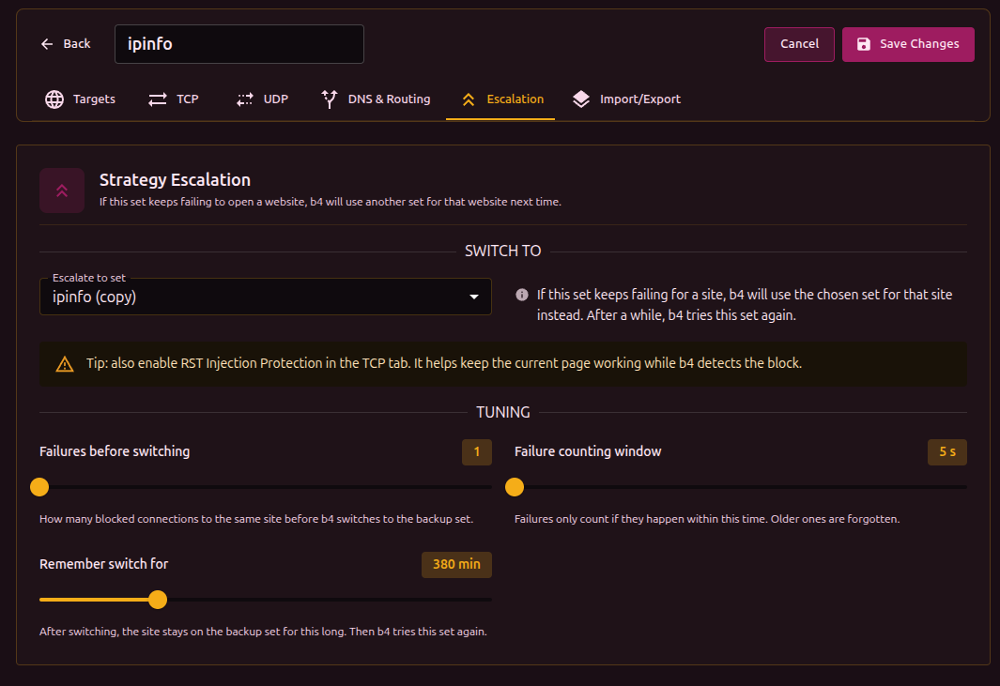

When a set in b4 keeps failing to open a site, b4 quietly switches that site to a backup set you choose. The next request to the site goes through the backup. After some time, b4 retries the original set in case the problem has cleared up.

## When you'd use it

If you have a "light" set that works for most sites and a "heavy" one that's slower but more reliable, escalation lets b4 use the light set most of the time and only fall back to the heavy one for sites that need it. Without escalation, sites that hit a block keep failing until you move them by hand.

## Setting it up

Open the set's **Escalation** tab. Under **Switch to** pick the backup set. Leave the other options at their defaults unless you want to fine-tune.

You can chain sets: A -> B -> C. b4 walks the chain as each one fails for a given site.

## Tuning options

- **Failures before switching** - how many failed attempts to the same site before b4 gives up on this set.
- **Failure counting window** - failures only count if they happen close together. Older ones are forgotten.
- **Remember switch for** - how long the site stays on the backup before b4 retries the original.

:::info Per-site tracking
The switch is remembered per-site (per-hostname). A problem with one site does not affect other sites that happen to share the same server.
:::

:::tip Pair with RST Injection Protection
Enable **RST Injection Protection** in the [TCP](./tcp/) tab of the original set. It helps existing connections survive while b4 detects the block.
:::

## Watching it work

The **Active Escalations** panel on the Dashboard shows currently-switched sites with the backup set name and time until retry. Use **Reset Stats** to clear all switches manually.

## What it does not do

- Escalation helps the **next** request, not the one that just failed; that connection is already lost.
- It only handles sites where bypass strategies fail. It does not fix sites that are unreachable for other reasons.
- It is not a substitute for [Discovery](../discovery). Discovery proactively finds a working strategy per site; escalation is a reactive safety net.
