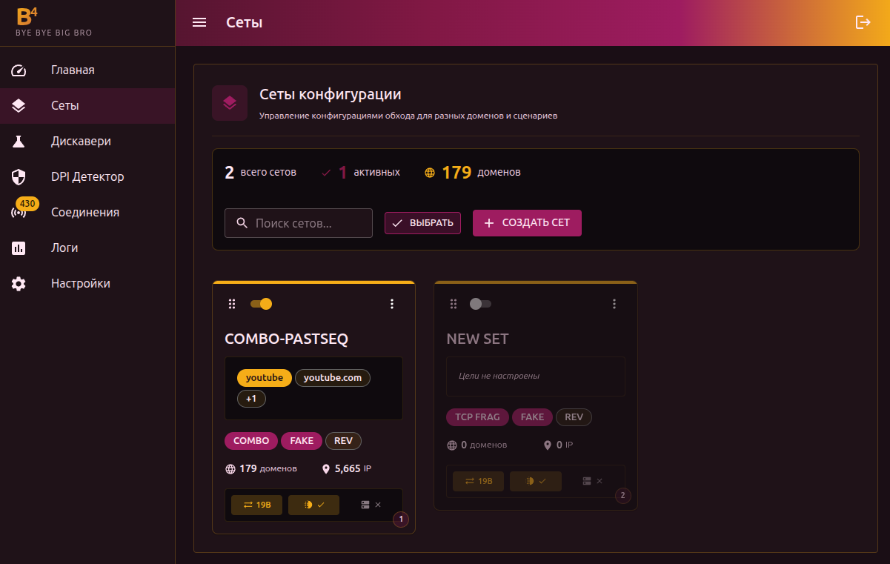
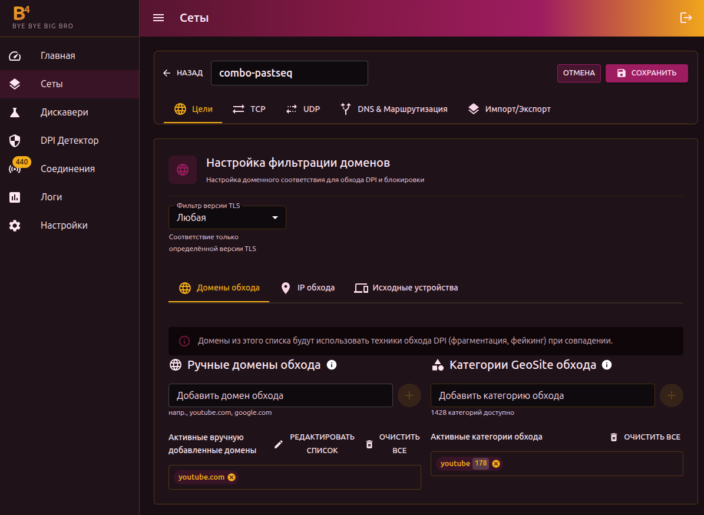
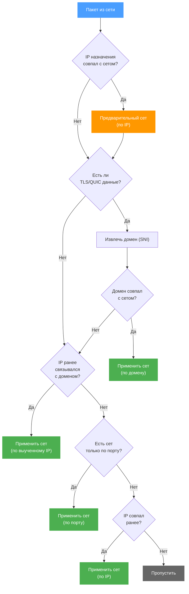

# Сеты

Сет — это набор настроек обхода DPI, привязанный к списку доменов, IP-адресов, UDP-портов  или категорий GeoSite/GeoIP. Можно создать несколько сетов с разными стратегиями для разных сайтов.

## Управление сетами

На странице **Сеты** отображаются все созданные наборы. Для каждого сета видно:

- Название и статус (включён/выключен)
- Количество доменов и IP
- Активные техники (COMBO, DISORDER, HYBRID и т.д.)
- Состояние DNS-маршрутизации и SNI Faking

Доступные действия:

- **Создать сет** — новый набор настроек
- **Редактировать** — клик по карточке
- **Дублировать** — создать копию существующего сета
- **Сравнить** — сравнение двух сетов в два столбца
- **Удалить** — удаление одного или нескольких сетов (через массовое выделение)
- **Перетаскивание** — изменение порядка сетов (порядок влияет на приоритет обработки)

## Редактор сета

Редактор содержит 5 вкладок:

- [Цели](./targets) — домены, IP, GeoSite/GeoIP категории, устройства
- [TCP](./tcp) — фрагментация, faking, desync и другие TCP-стратегии
- [UDP](./udp) — обработка UDP-трафика, QUIC, STUN
- [Маршрутизация](./routing) — DNS-редирект и маршрутизация трафика через интерфейсы
- **Импорт/Экспорт** — JSON-представление конфигурации сета для переноса между устройствами

## Как это работает

### Порядок сопоставления

1. **IP-адрес** — проверяется первым. Если IP назначения совпал с IP/CIDR в каком-то сете, это запоминается как предварительное совпадение
2. **Домен (SNI)** — если в пакете есть TLS/QUIC-данные, b4 извлекает домен. Если домен совпал с сетом — **этот сет заменяет** предварительное совпадение по IP. Домен всегда имеет приоритет
3. **Выученный IP** — если b4 ранее видел этот IP в связке с доменом (из предыдущих соединений), используется тот же сет
4. **Порт** — проверяется, только если сет настроен исключительно по порту (без доменов и IP)
5. **Предварительный IP** — если ни домен, ни выученный IP, ни порт не сработали, используется совпадение по IP из шага 1

:::tip Фильтр портов
Если в сете настроен фильтр портов — он работает как дополнительное условие. Даже если домен или IP совпали, пакет будет обработан только при совпадении порта.
:::

:::info Выбор сета при нескольких совпадениях
Если один и тот же домен или IP настроен в нескольких сетах, b4 выбирает сет по приоритету:

1. Сет с указанным **исходным устройством**, совпавшим с MAC отправителя + совпавшей **версией TLS**
2. Сет без привязки к устройству + совпавшей версией TLS
3. Если ни один сет не подошёл по TLS — версия TLS игнорируется и проверка повторяется

Таким образом, сеты с привязкой к устройствам всегда имеют приоритет над общими, а фильтр TLS-версии уточняет выбор, но не блокирует обработку.
:::

:::info Выученные IP
Когда b4 видит соединение, где домен (SNI) совпал с сетом, он запоминает связку IP → домен на 10 минут. Это ускоряет обработку последующих пакетов к тому же серверу, даже если в них нет SNI.
:::

### Что происходит при совпадении

Для TCP-пакетов b4 перехватывает оригинальный пакет и отправляет вместо него модифицированную версию. В зависимости от настроек сета применяются:

1. Удаление SACK-опции (если включено)
2. Мутация ClientHello (если включена)
3. Десинхронизация (RST/FIN/ACK)
4. Манипуляция TCP-окном
5. Отправка фейковых SNI-пакетов
6. Фрагментация по выбранной стратегии

Для UDP — пакет либо отбрасывается (режим drop), либо заменяется фейковым ответом (режим fake).

Если ни один сет не совпал — пакет проходит без изменений.

## Импорт и экспорт

Вкладка **Импорт/Экспорт** показывает JSON-конфигурацию сета. Можно:

- Скопировать JSON для переноса на другое устройство
- Вставить JSON для импорта конфигурации

Исходные устройства (MAC-адреса) не экспортируются — их нужно настроить заново на целевом устройстве.
