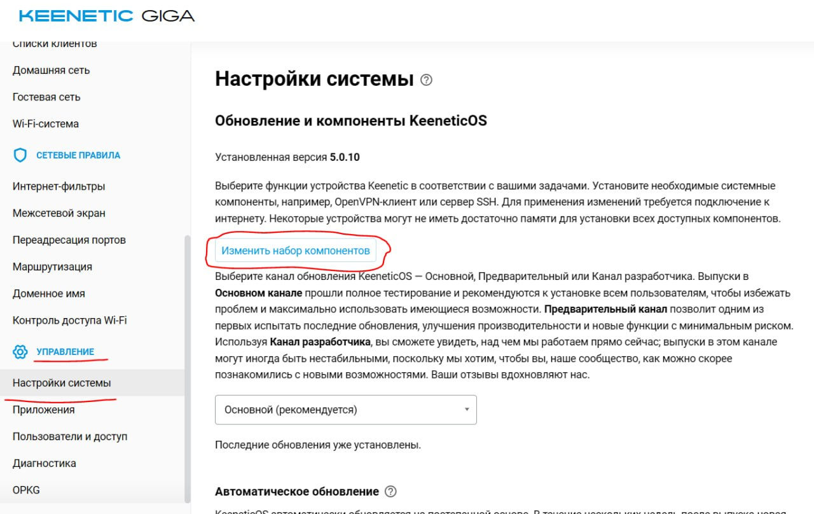
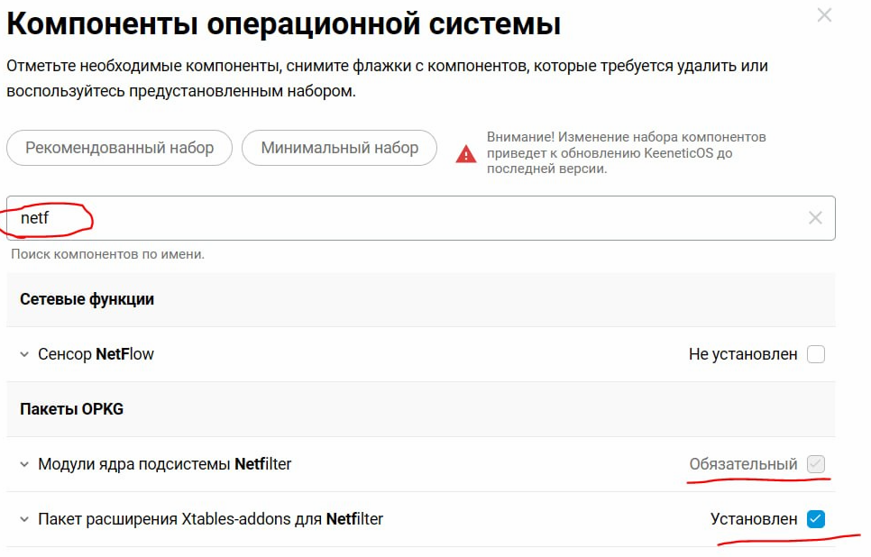

# Keenetic

## Требования

- Роутер Keenetic с поддержкой OPKG
- Установленный Entware (обязательно)

## Установка Entware

### Новые модели (со встроенным хранилищем)

1. Откройте веб-интерфейс роутера
2. Перейдите в **Параметры системы**
3. Включите компонент **Менеджер пакетов OPKG**

### Старые модели (нужен USB-накопитель)

1. Вставьте USB-накопитель в роутер
2. Установите Entware через менеджер пакетов

Подробнее: [help.keenetic.com](https://help.keenetic.com/hc/en-us/articles/360021214160)

## Включите компоненты Netfilter

Прошивка Keenetic NDMS не содержит всех модулей netfilter, которые нужны b4, "из коробки". Перед установкой b4 включите необходимые компоненты:

1. В веб-интерфейсе роутера откройте **Параметры системы** → **Обновление компонентов**
1. Включите компонент **NetFilter** — это базовый компонент netfilter
1. После включения NetFilter в списке появится **Xtables-addons for Netfilter** — включите и его (даёт `xt_connbytes` и другие расширения, от которых зависит b4)
1. Примените изменения и дождитесь перезагрузки / применения компонентов




Затем по SSH установите пользовательскую часть iptables:

```bash
opkg install iptables
```

:::info
Компоненты системы в Keenetic доступны только под учёткой `admin`
:::

## Установка b4

Подключитесь по SSH и выполните:

```bash
curl -fsSL https://raw.githubusercontent.com/DanielLavrushin/b4/main/install.sh | sh
```

## Управление сервисом

```bash
/opt/etc/init.d/S99b4 start
/opt/etc/init.d/S99b4 stop
/opt/etc/init.d/S99b4 restart
```

## Пути

| Что          | Где                     |
| ------------ | ----------------------- |
| Бинарник     | `/opt/sbin/b4`          |
| Конфигурация | `/opt/etc/b4/b4.json`   |
| Сервис       | `/opt/etc/init.d/S99b4` |

## Архитектура

- Старые модели (MT7621) - `mipsle_softfloat`
- Новые модели (aarch64) - `arm64`

Установщик определяет архитектуру автоматически.

:::warning Без Entware
Без Entware b4 устанавливается в `/tmp`, который очищается при каждой перезагрузке. Для постоянной работы Entware обязателен.
:::

## Диагностика

После запуска сервиса проверьте лог:

```bash
cat /var/log/b4/errors.log
```

Если там есть `xt_connbytes kernel module is not available`, компоненты Netfilter включены не полностью — вернитесь к разделу [Включите компоненты Netfilter](#включите-компоненты-netfilter) выше и убедитесь, что активированы **оба** компонента: **NetFilter** и **Xtables-addons for Netfilter**.

Если лог пустой (или в нём нет ошибок), веб-интерфейс b4 должен быть доступен по LAN-адресу роутера.
