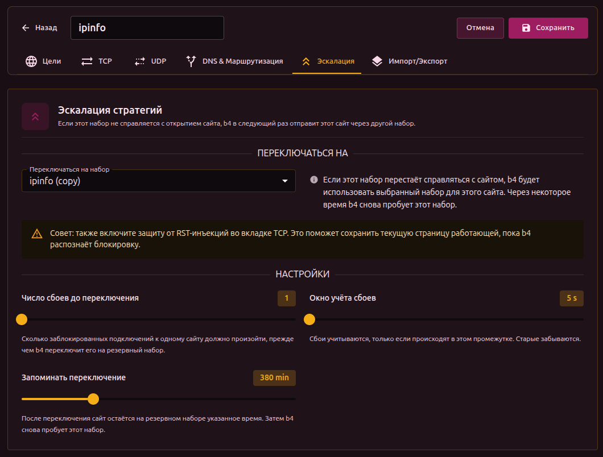

Если набор в b4 перестаёт справляться с открытием сайта, b4 переключает этот сайт на выбранный резервный набор. Следующий запрос к сайту идёт через резервный. Через некоторое время b4 снова пробует исходный набор - вдруг проблема уже исчезла.

## Когда это нужно

Если у вас есть "лёгкий" набор, который работает для большинства сайтов, и "тяжёлый" - помедленнее, но надёжнее, эскалация позволяет b4 использовать лёгкий по умолчанию и уходить на тяжёлый только для сайтов, которым он действительно нужен. Без эскалации сайты, которые попали под блокировку, продолжают не открываться, пока вы вручную не перенесёте их.

## Как настроить

Откройте вкладку **Эскалация** в наборе. В поле **Переключаться на** выберите резервный набор. Остальные параметры можно оставить со значениями по умолчанию.

Наборы можно объединять в цепочку: A -> B -> C. b4 идёт по цепочке по мере того, как каждый набор перестаёт справляться с конкретным сайтом.

## Параметры

- **Число сбоев до переключения** - сколько неудачных попыток к одному сайту должно быть, прежде чем b4 переключит его.
- **Окно учёта сбоев** - сбои учитываются, только если происходят в этом промежутке. Старые забываются.
- **Запоминать переключение** - сколько времени сайт остаётся на резервном наборе, прежде чем b4 снова пробует исходный.

:::info Учёт по сайту
Переключение запоминается отдельно для каждого сайта (по hostname). Проблема с одним сайтом не затрагивает другие сайты, которые могут располагаться на том же сервере.
:::

:::tip Используйте вместе с RST Injection Protection
Включите **RST Injection Protection** во вкладке [TCP](./tcp/) исходного набора. Это поможет сохранить активные соединения, пока b4 распознаёт блокировку.
:::

## Где смотреть результат

Панель **Активные переключения** на Дашборде показывает сайты, которые сейчас идут через резервные наборы, с именем резервного набора и временем до повторной попытки. Кнопка **Сброс статистики** очищает все переключения вручную.

## Чего эта функция не делает

- Эскалация помогает **следующему** запросу, а не тому, который только что упал - то соединение уже потеряно.
- Она работает только с сайтами, где не справляются стратегии обхода. Сайты, недоступные по другим причинам, она не чинит.
- Она не заменяет [Discovery](../discovery). Discovery заранее подбирает рабочую стратегию для сайта; эскалация - страховка постфактум.
